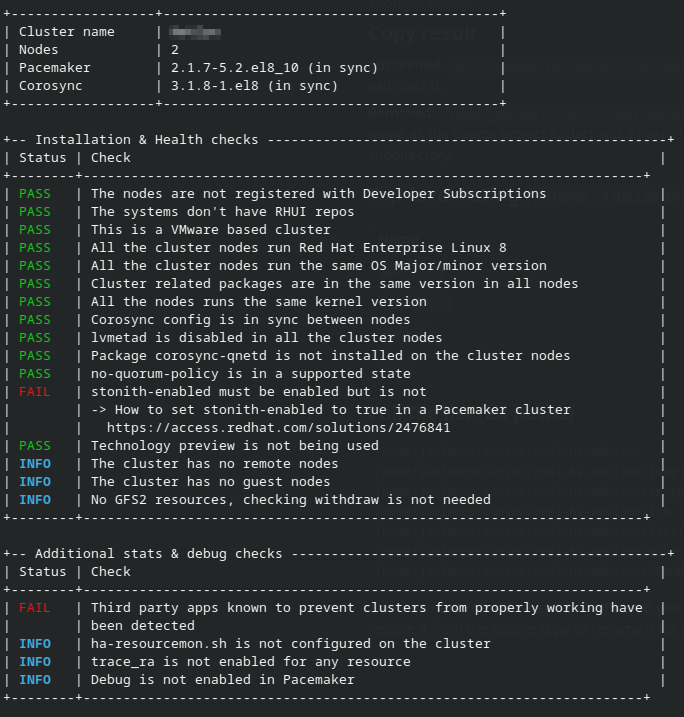

# RHEL HA Advisor

Quick CLI tool to review unpacked sosreports for supportability issues in Red Hat High Availability and Resilient Storage cluster installations. Supports standard `sosreport` and `soscleaner` output.

The tool compares multiple sosreport folders from the same cluster and prints a cluster summary plus installation, health, and diagnostic checks.

# Installation

From a clone of this repository:

```bash
make install                        # installs to /usr/local/bin and /usr/local/share/rhel-ha-advisor
make install PREFIX=$HOME/.local    # user-local install
```

You can also run it directly from the repository:

```bash
./rhel-ha-advisor PATH-TO-SOSREPORTS PATH-TO-TMPFILES
```

# How to run

```bash
rhel-ha-advisor [OPTIONS] PATH-TO-SOSREPORTS PATH-TO-TMPFILES
```

## Arguments

| Argument | Description |
|----------|-------------|
| `PATH-TO-SOSREPORTS` | Directory containing unpacked sosreport folders |
| `PATH-TO-TMPFILES` | Base directory where a unique 8-digit work folder is created for temporary comparison files |

## Options

| Option | Description |
|--------|-------------|
| `-h`, `--help` | Show usage and exit |
| `-V`, `--version` | Show version and exit |
| `--no-color` | Disable colored output |

## Workflow

1. Point the tool at a directory with unpacked sosreport folders.
2. The tool lists the available folder names.
3. You are prompted interactively for each sosreport folder to include in the analysis.
4. The first sosreport is used to detect cluster type and node count; additional prompts follow for the remaining nodes.
5. Results are printed to the terminal.

Sosreport folders can be either:

- **Direct layout:** `sosreport-hostname-.../installed-rpms`, `etc/`, `sos_commands/`, etc.
- **Wrapped layout:** `folder-name/inner-hostname-dir/installed-rpms`, etc.

# Example execution

```bash
$ rhel-ha-advisor ~/sosreports /tmp/rhel-ha-advisor-work
```

```
Sosreports directory: /home/user/sosreports
Temporary files will be created in: /tmp/rhel-ha-advisor-work/48291037

sosreport-node1-2025-08-20-abc123
sosreport-node2-2025-08-20-def456

(1) Enter the sosreport folder name: sosreport-node1-2025-08-20-abc123
(2) Enter the sosreport folder name: sosreport-node2-2025-08-20-def456

```



# Current features

## Cluster summary

- Cluster name detection
- Node count
- Pacemaker and Corosync package versions
- Version mismatch detection across nodes

## Installation and health checks

- Developer subscription usage
- RHUI repository detection
- Supported hardware / virtualization platform checks
- RHEL version consistency across nodes
- Cluster package version consistency
- Kernel version consistency
- Corosync configuration sync
- `lvmetad` status on RHEL 7 clusters
- `corosync-qnetd` package presence
- `no-quorum-policy` validation
- `stonith-enabled` validation
- Technology Preview feature detection (RHEL 7 and 8)
- Remote and guest node detection
- GFS2 withdraw checks

## Additional stats and debug checks

- Third-party applications known to interfere with clusters
- `ha-resourcemon.sh` configuration
- `trace_ra` usage
- Pacemaker debug settings

# Output format

Check results are shown in ASCII tables with colored status labels:

| Status | Meaning |
|--------|---------|
| `PASS` | Check passed (green) |
| `FAIL` | Check failed (red); related KCS links may be shown |
| `WARN` | Warning (yellow) |
| `INFO` | Informational result (blue) |

Use `--no-color` to disable terminal colors.

# Scope

- Red Hat Enterprise Linux 7 and newer clustered environments based on Corosync/Pacemaker.

# Project layout

```
rhel-ha-advisor       CLI entry point
lib/functions.sh      Check functions and report logic
Makefile              Install/uninstall targets
images/               Example screenshots
```

-----

The tool is under active development. Suggestions and issue reports are welcome.
This project is not developed/provided/supported by Red Hat.

-----
